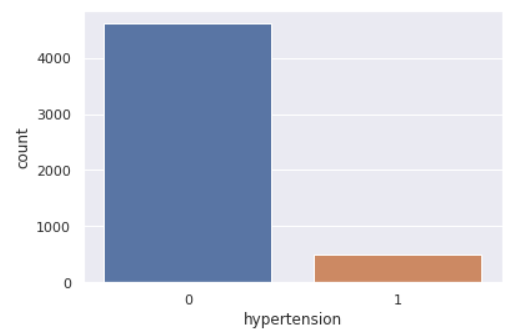
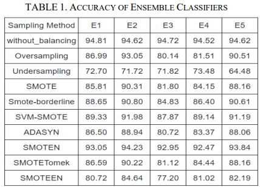

# Stroke-Prediction-Analysis
Solving class imbalance problem using SMOTE and SMOTE variants.
Comparative analysis of machine learning models to predict stroke using ensemble learning

## Problem
Early stroke diagnosis is crucial for timely intervention and improved patient outcomes. Medical datasets often suffer from class imbalance, where stroke cases are underrepresented. This project investigates ensemble learning models and SMOTE variants to handle class imbalance and improve stroke prediction accuracy.

## Data
Dataset: Dataset: [Link to dataset file](healthcare-dataset-stroke-data.csv)

Class Imbalance Ratio:

## Methodology
SMOTE Techniques: BorderLine-SMOTE, SVM-SMOTE, ADASYN, SMOTEN, SMOTE-NC and SMOTEENN
Base Learners: Random Forest, Decision Tree, Bagging Classifier, Voting Classifier, Gradient Boosting Classifier, xGBoost, KNeighbors, AdaBoost Classifier, SVM, Logistic Regression, BernoulliNB and GaussianNB
Ensemble Model: We used 5 different ensemble classifiers. The best ensemble is the combination of Random Forest, Bagging Classifier and Decision Tree.
Evaluation Metrics: Precision, Accuracy, Recall, ROC Curve, F1 Score

## Results
Comparison of performance scores for different SMOTE variants and ensemble models
Class Imbalance Ratio: 

## Code
[Link to notebook](Stroke_Prediction.ipynb)

## Conclusion
The goal of this research project is to use SMOTE approaches to tackle the imbalance issue and prepare a comparative analysis between multiple machine learning classifiers.
Five different ensemble classifiers were framed and their performance was analyzed. The average k-fold-mean accuracy for ensemble classifiers with SMOTE-EEN is 95.10%.

email: muditb0712@gmail.com

